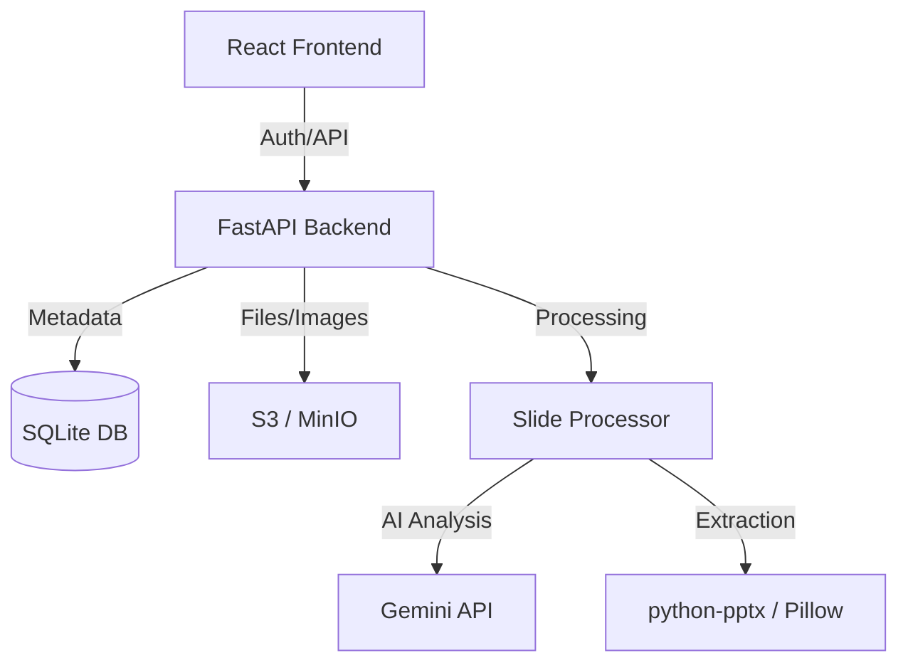

# Script Writer: AI-Powered Slide Narration

**Script Writer** is a sophisticated, industrial-minimalist web application designed to transform PowerPoint presentations into polished, flowing narration scripts. Using the power of **Google Gemini 2.5 Flash**, it extracts slide content and speaker notes to generate context-aware narrations that feel natural and engaging.


---

## Key Features

- **Project Management**: Organize your work into persistent projects with names and descriptions.
- **Dual-Pass AI Processing**:
  - **Content Rewriting**: Optimizes slide text for clarity and impact.
  - **Fluid Narration**: Generates a continuous script that flows naturally from one slide to the next.
- **Focused Refinement**:
  - **Studio Editor**: A dedicated full-screen mode for fine-tuning individual slides.
  - **AI Refinement**: Ask the AI to rewrite specific blocks with custom instructions (e.g., "Make it more punchy", "Explain like I'm 5").
  - **Global Rewriting**: Update the tone or style of the entire presentation in one click.
- **S3-Backed Storage**: All presentations and extracted slide images are stored securely in S3 (or MinIO), ensuring data persistence and easy scaling.
- **Multi-Format Export**: Download your final results as **PDF**, **DOCX**, **TXT**, **JSON**, or even a **new PPTX** with the narrations injected back into the speaker notes.
- **Secure Multi-Tenancy**:
  - **User Accounts**: Personal workspaces where users can only see their own projects.
  - **Admin Panel**: Manage users, reset passwords, and oversee system health.
- **Industrial Aesthetic**: A premium, responsive UI featuring Dark/Light modes with smooth transitions.

---

## Tech Stack

- **Backend**: [FastAPI](https://fastapi.tiangolo.com/) (Python 3.9+)
- **Frontend**: [React](https://reactjs.org/) + [TailwindCSS](https://tailwindcss.com/) + [Vite](https://vitejs.dev/)
- **AI Engine**: [Google Gemini 2.5 Flash](https://ai.google.dev/)
- **Database**: SQLite with [SQLAlchemy](https://www.sqlalchemy.org/)
- **Storage**: [AWS S3](https://aws.amazon.com/s3/) / [MinIO](https://min.io/)
- **Deployment**: [Docker](https://www.docker.com/) & Docker Compose

---

## Installation and Setup

The easiest way to run Script Writer is using Docker.

### Prerequisites

- Docker and Docker Compose
- A [Google Gemini API Key](https://aistudio.google.com/app/apikey)
- (Optional) AWS S3 Credentials or a local MinIO setup

### Quick Start

1. **Clone the repository**:
   ```bash
   git clone https://github.com/mhdatheek136/Script_writter.git
   cd Script_writter
   ```

2. **Configure Environment**:
   Create a `.env` file in the root directory (use `.env.example` as a template):
   ```bash
   # Core
   GEMINI_API_KEY=your_gemini_key
   JWT_SECRET_KEY=your_random_secret_string

   # Storage (S3/MinIO)
   S3_BUCKET_NAME=your_bucket
   S3_ACCESS_KEY=your_key
   S3_SECRET_KEY=your_secret
   S3_ENDPOINT=http://minio:9000 # For local Minio
   ```

3. **Run with Docker**:
   ```bash
   docker-compose up --build
   ```

4. **Access the App**:
   - **Frontend**: [http://localhost:8000](http://localhost:8000)
   - **API Docs**: [http://localhost:8000/docs](http://localhost:8000/docs)
   - **Default Admin**: `admin@example.com` / `changeme123` (Change this immediately!)

---

## Architecture



- **/app**: Backend API source code, routers, and services.
- **/frontend**: React application source code and building logic.
- **/data**: Persistent SQLite database storage.

---

## License

This project is an internal tool. All rights reserved.

---

*Built for rapid content creation.*
